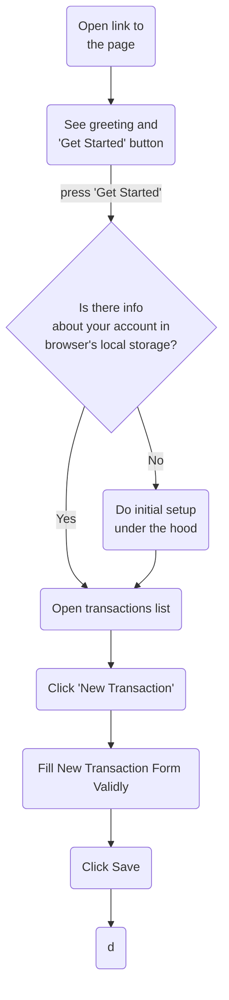

```mermaid
flowchart TD
  A(Open link to\nthe page) --> B("See greeting and\n'Get Started' button")
  B -->|press 'Get Started'| C{Is there info\n about your account in\n browser's local storage?}
  C -->|Yes| D
  C -->|No| C1(Do initial setup\n under the hood)
  C1 --> D(Open transactions list)
  D
    --> E(Click 'New Transaction')
    --> E1(Fill New Transaction Form Validly)
    --> E2(Click Save)
    --> E3(d)
```
